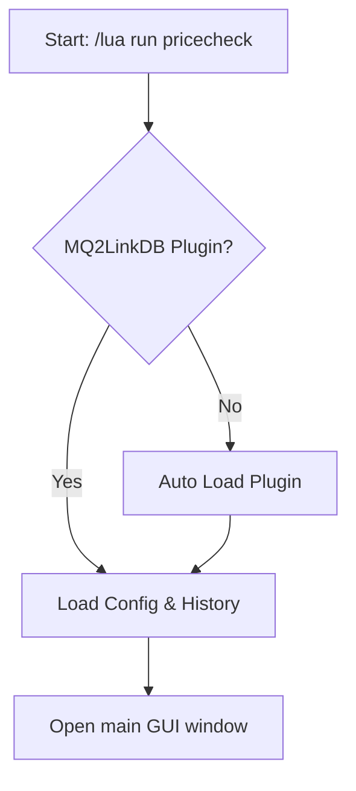
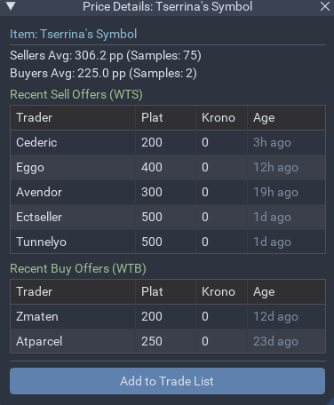
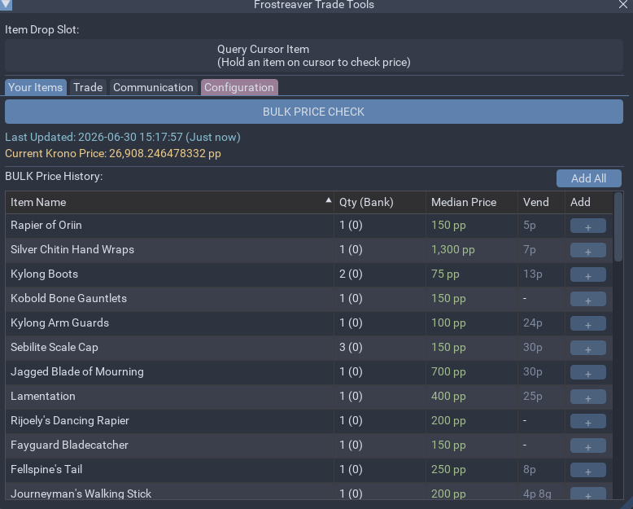
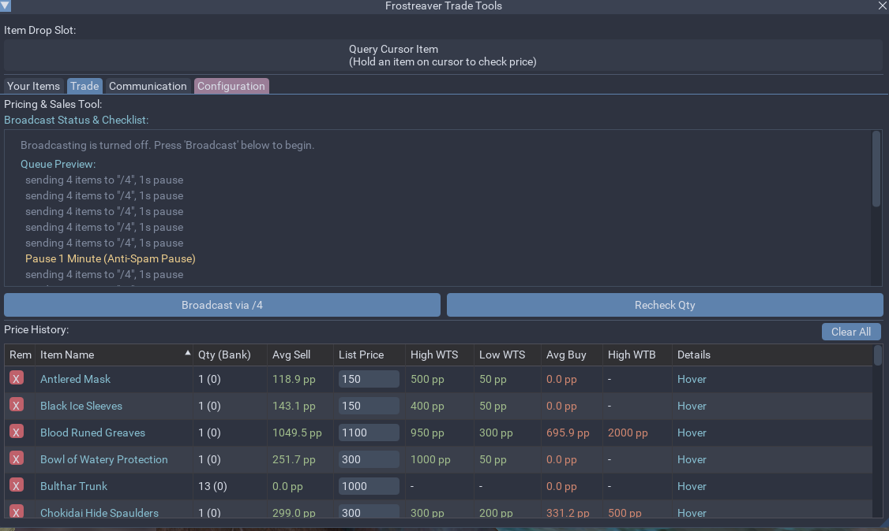
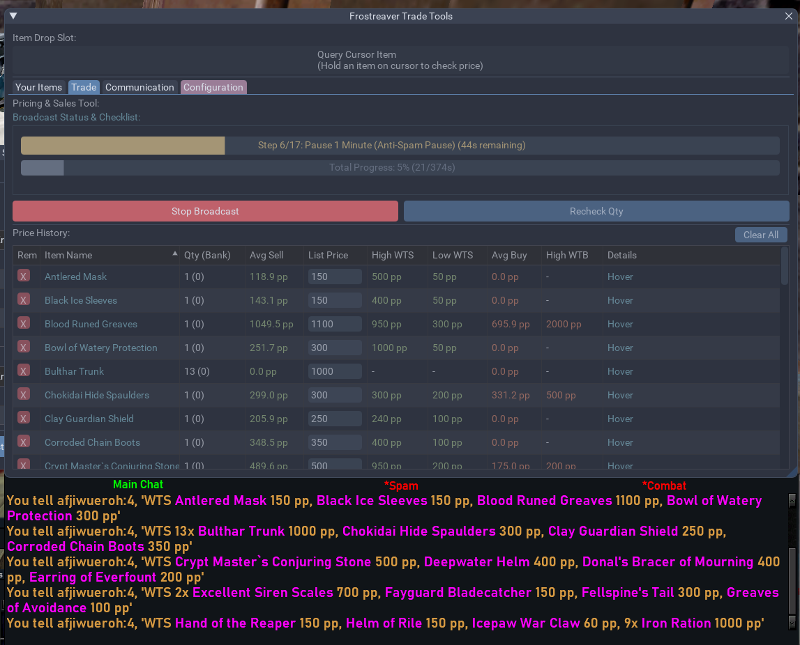
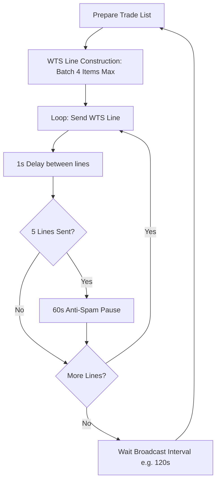
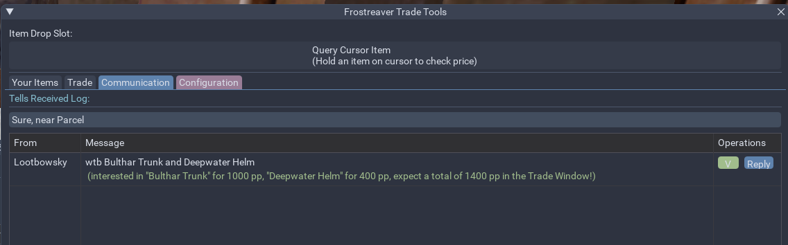
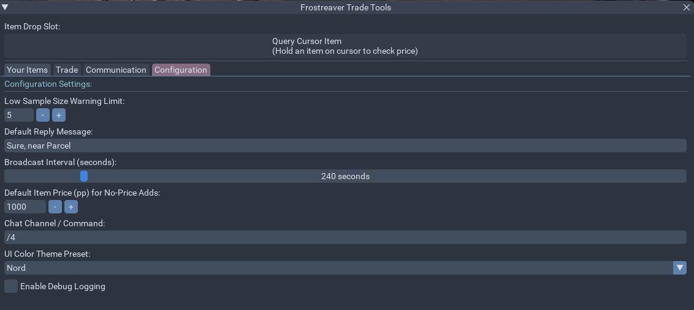

# EverQuest MacroQuest PriceCheck

An in-game market checking, bulk inventory evaluation, and sales broadcasting assistant for EverQuest Time-Locked Progression (TLP) servers, built for the MacroQuest Lua Sandbox.

---

## 🤖 AI-Assisted Development
> [!NOTE]
> This codebase was developed with heavy AI assistance. All major features, bug fixes, architecture splits, safety error-resiliency wrappers (`pcall`s), and ImGui layout designs were codeveloped, refactored, and audited in collaboration with **Antigravity**, Google DeepMind's agentic coding AI.

## 🚀 Intent & Core Purpose
**PriceCheck** acts as your personal merchant companion in EverQuest. It connects directly to live progression market API endpoints (`tlp-auctions.com`) to evaluate item values, log user tells, and automate broadcast marketing (`/auction`) with human-like timing delay debounces. It ensures you never undersell valuable loot to NPC merchants or buy items at inflated prices.

---

## ✨ Key Features

* **Appraisal Drop Slot & Command Queries**: Drag items to the in-game Drop Slot or query them with commands to open a detailed floating statistics window containing live analytics (Average WTS/WTB, High/Low WTS/WTB, and sample counts) along with recent transaction logs.
* **Bulk Inventory Scanner**: Instantly inventory and evaluate all items in your character's active bags on demand. The scanner matches item IDs against the server database, identifies item values, and warns you in **gold** when an NPC merchant is willing to pay more than the player-to-player market median!
* **Trade Queue Manager**: Collect, view, and organize items you wish to sell. Includes editable listed price boxes (auto-calculated and rounded based on averages), warning flags `[!]` for thin statistical sample sizes, and detailed transaction tooltips.
* **Cursor Integration**: Right-click any item in your active trade queue, and the script automatically picks up that item from your inventory to your cursor, eliminating tedious bag searches.
* **Anti-Flood Broadcasting Queue**: Compiles multi-item `/auction` lines (grouping up to 4 items per line with quantities and price links). A live timeline dashboard schedules 1-second line-send pauses, a 60-second anti-spam delay after every 5 lines, and custom interval loops to prevent client rate-limits or server chat bans.
* **Smart Tells Logger & Interest Matcher**: Logs incoming customer tells in a clean tab. The message text is dynamically parsed against your active trade list. If a client mentions a listed item, the logger highlights their interest, displays your listed plat price, and calculates the exact sum total to expect in the trade window.
* **Visual Theme Customization**: Features a styling suite supporting 6 presets (Default, Solarized Dark, Nord, Pastel, Solarized Light, and Windows 95) that adapt beautifully to your personal UI setup.
* **Resilient Data Persistence**: Configuration settings and listing histories are pickled and saved to your MacroQuest directory automatically, ensuring you never lose your setup between sessions.

---

## 🔄 The User Flow: A Step-by-Step Walkthrough

### 1. Initialization and Setup
* Launch the script in-game with the command:
  ```text
  /lua run pricecheck
  ```
* The script checks for the required dependency `MQ2LinkDB`. If missing, it dynamically loads it via `/plugin MQ2LinkDB` to ensure color-coded item links can be generated.
* The main GUI window **Frostreaver Trade Tools** opens, loading your previously saved configuration and trade list from storage.



---

### 2. Sizing Up Your Stock (Item Appraisal)
You have three methods to price and add items to your list:
* **The Cursor Drop Slot**: Pick up an item on your cursor. The top bar of the script changes from a placeholder warning to a clickable **Click to Check: [Item Name]** button. Click it to open the floating *Price Details* window.
* **Slash Commands**: Run `/pricecheck` (for the item on your cursor) or `/pricecheck <Item Name>` (e.g., `/pricecheck Fire Beetle Eye`). This queries the API and opens the details window.



* **Bulk Inventory Scanning**: Navigate to the **Your Items** tab and click **BULK PRICE CHECK**. The script scans your worn bags (slots 23 to 34) for unique items, bundles them, and checks them in batches. 
  * If the lookup succeeds, a sortable table updates with quantities, bank counts, median market prices, and NPC merchant values.
  * **Vendor Profit Alert**: If an item's NPC merchant value exceeds or equals the player market median price, the item name glows **Gold** and displays a tooltip: *"Vendor sell price is higher or equal to market median price!"*. This tells you to sell it to an NPC instead of listing it to players.
  * Click the `+` button on any item to add it to your broadcast list. (If the item has no market history, the `+` button turns red, adding it using your configured fallback price).
  * Click **Add All** to add all checked items with active prices in one go (hover to see estimated query durations).



---

### 3. Setting Up the Trade List (The "Trade" Tab)
* Once items are added, they populate the **History / Price History** table on the **Trade** tab.
* **Quantity Rechecks**: Click **Recheck Qty** to update the carried and banked count values.
* **Price Adjustment**: The script auto-calculates a listing price based on market averages and rounds it for clean formatting (rounded to the nearest 10 for prices $\le$ 100, nearest 50 for prices $\le$ 1000, and nearest 100 for prices > 1000). You can click directly in the **List Price** input field to adjust the plat price manually.
* **Reviewing Pricing Spread**: Review columns for Average Sell, List Price, High WTS, Low WTS, Average Buy, and High WTB.
* **Details Tooltip**: Hover over the **Hover** link in the Details column to see a pop-up transaction table of the 5 most recent WTS and WTB player sales, showing character names, plat values, Krono rates, and relative time ages (e.g., "5m ago").
* **Grab Item to Cursor**: Right-click the name of any item in the history table. The script uses `/itemnotify` to automatically pick up the item and place it on your cursor, letting you grab it out of your bags instantly when completing a trade.



---

### 4. Running the Sales Broadcast
* Review the **Queue Preview** inside the **Timeline Checklist** scroll area on the Trade tab. It formats WTS lines, grouping up to 4 items on a single line to minimize chat footprint, incorporating colorized game links when broadcasting.
  * *Example line:* `/auction WTS 2x [Golden Fire Opal Ring] 100 pp, [Fire Beetle Eye] 10 pp`
* Click the **Broadcast via [Channel]** button. The script transitions into live broadcasting mode:
  * A green **Current Step Progress Bar** animates, tracking the countdown of active chat sends (1s pause) or anti-spam delays (60s pauses).
  * A grey **Total Cycle Progress Bar** displays the overall time percentage completed in the current cycle loop.
  * Adjust listing prices on the fly or click **Stop Broadcast** at any time to freeze the loop.





---

### 5. Managing Transactions (The "Communication" Tab)
* When a customer sends you a direct message, it bypasses your chat log spam and registers under the **Communication** tab.
* **Interest Highlights**: The tell logger scans the message text. If the buyer mentions one of your listed items, a green alert message is printed:
  * *Example:* `(interested in "Golden Fire Opal Ring" for 100 pp, expect a total of 100 pp in the Trade Window!)`
  * If they mention multiple items, it sums them up automatically!
* **Quick Replies**: Enter a response template in the input box (e.g., `"Sure, near Parcel"`). Click **Reply** next to the customer's name to instantly send them that tell.
* **Clearing Completed Transactions**: Click the **V (Done)** button next to the customer's entry to remove them from the queue.



---

## ⚙️ Configuration Dashboard

Customize your trading flow under the **Configuration** tab:



| Setting | Type | Default | Description |
| :--- | :--- | :--- | :--- |
| **Low Sample Size Warning Limit** | InputInt | `5` | The sample threshold below which a red `[!]` warning icon is shown on listings. |
| **Default Reply Message** | InputText | `Sure, near Parcel` | The message text sent when clicking the quick Reply button in tells. |
| **Broadcast Interval (seconds)** | SliderInt | `120` | Cooldown period between completing a WTS cycle and starting the next (120s - 1200s). |
| **Default Item Price (pp)** | InputInt | `1000` | The fallback plat price assigned to items with no online statistics when added. |
| **Chat Channel / Command** | InputText | `/auction` | The command prefixed to broadcast lines (e.g. `/auction`, `/shout`, `/gu`). |
| **UI Color Theme Preset** | Combo | `Default` | Visual color profile styles (Default, Solarized Dark, Nord, Pastel, Solarized Light, Windows 95). |
| **Enable Debug Logging** | Checkbox | `false` | Outputs active state changes and API request responses to the console. |

---

## 📦 Installation & Directory Setup

1. Copy the `pricecheck` folder structure directly into your MacroQuest directory:
   ```text
   <MacroQuest_Directory>/lua/pricecheck/
   ```
2. Confirm the directory contains the following structure:
   ```text
   pricecheck/
   ├── init.lua
   ├── instructions.md
   ├── README.md
   └── modules/
       ├── char.lua
       ├── chat.lua
       ├── dto.lua
       ├── http.lua
       ├── log.lua
       ├── state.lua
       ├── storage.lua
       ├── theme.lua
       ├── ui.lua
       └── util.lua
   ```
3. Boot up the EverQuest client and start the lua script:
   ```text
   /lua run pricecheck
   ```
